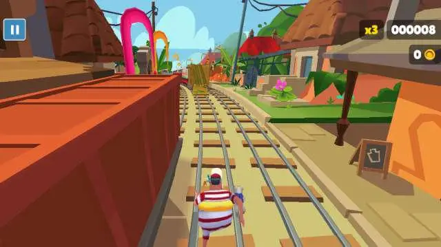
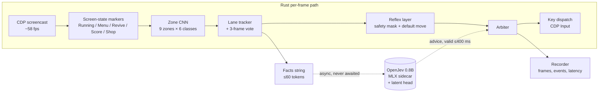
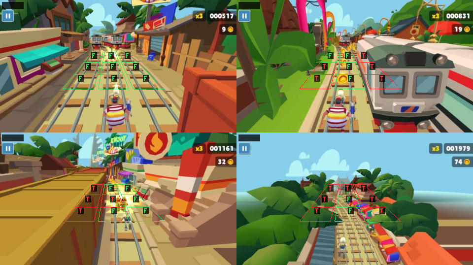

# Reflexes First, Language Second: A Real-Time Hybrid Agent for Subway Surfers in the Browser

**Arindam Pradhan**

*October 2026*

---

## Abstract

We present a bot that plays the endless-runner game *Subway Surfers* in an unmodified Chrome window. It has no game API: it sees only screen pixels and acts only through key presses. The agent splits control by time scale:

- **Perception.** A 261k-parameter convolutional network, written in Rust, classifies 9 track zones (3 lanes × near/mid/far) into 6 obstacle classes on every frame.
- **Reflex layer.** A rule-based layer, also in Rust, masks out actions that would kill the runner and acts within one frame.
- **Advisor.** A small natural-language-inference model, OpenJev 0.8B (a Qwen3.5 cross-encoder) running on MLX, ranks the safe actions from a closed-vocabulary text description of the scene. It is used only when its answer is fresh and the reflexes agree it is safe.

The zone labels were produced by a multimodal LLM under a written labelling guide. On a frozen held-out set of 311 frames (1,890 zones), the zone classifier reaches 95.8 % accuracy, misses 2.4 % of hazards, raises false alarms on 3.1 % of free zones and recalls 97.3 % of barriers.

In a 47-run benchmark the agent survives a median 9.8 s and scores a median 343. Its best run lasts 47.0 s and scores 2,230. The full per-frame loop runs at 58.5 fps with a median latency of 19.0 ms.

We also report negative results that shaped the design:

- **Imitation learning** from 20k frames of human play did worse than the rules.
- **Local vision-language models** missed between 24 % and 96 % of hazards as labellers.
- **Two camera-lag corrections** to the lane-change logic both lowered median survival in A/B tests.
- **Perception accuracy alone did not raise survival.** It rose from 68 % to 91 % while median survival stayed at 3–5 s, until the barrier classes were fixed.

---

## 1 Introduction

Endless runners are a hard test of real-time control:

- The world scrolls toward the player at increasing speed.
- A wrong move is fatal.
- The right move often depends on objects that are visible for only a fraction of a second.

Played in a browser, the game also gives no access to its state. An agent must read pixels from the screen, decide, and press keys, all within a frame budget.

Large language models are good at choosing between described options, but far too slow for this loop. A 0.8B model takes about 250 ms per decision, while frames arrive every 17 ms. We therefore ask a narrower question: **can a small language model contribute to real-time play at all, if it never sits on the critical path?**

Our answer is a two-speed architecture (Figure 1). A Rust reflex layer acts on every frame and decides which moves are safe. A language-model advisor works in the background on a text summary of the scene and breaks ties among those moves. The advisor's advice expires after 400 ms. The reflex layer never waits for it.

**Contributions.**

1. **A complete real-time agent** for a commercial browser game. Its per-frame path (capture, perception, policy, input) is entirely in Rust. It holds 58.5 fps at a median 19.0 ms per frame, with the CNN included.
2. **A two-layer policy** in which an NLI cross-encoder ranks reflex-safe actions from a fixed vocabulary of scene facts. It includes an advisor head trained on the model's latents. On a 27-case decision benchmark, this head raises the 0.8B model's accuracy from 14/27 to 26/27.
3. **A perception pipeline built on LLM-labelled data.** It covers a strict labelling guide, measured inter-labeller agreement and hard-example mining. It lifts held-out barrier recall from 49 % to 97 %.
4. **An honest live evaluation.** It quantifies benchmark noise and reports the negative results: imitation learning, local VLM labellers and lane-change corrections.



*Figure 0. The agent's best benchmarked run (score 2,230, 47.0 s), shown at 2× speed. [Full-quality video](media/best-run-original.mp4).*

---

## 2 Related work

**Learning from pixels in games.** Deep reinforcement learning reached human-level play on Atari from raw pixels (Mnih et al., 2015) in the Arcade Learning Environment (Bellemare et al., 2013). These systems need millions of frames from an emulator that can be reset and sped up. A live browser game on a third-party site allows neither, so we use supervised perception and hand-written control.

**Imitation from human play.** Video PreTraining (Baker et al., 2022) learned Minecraft control from labelled human video at very large scale. We tried a small version of this, behavioural cloning from 20,843 key-logged frames. It did worse than a constant "stay" baseline (§6.6).

**Language models as decision makers.** NLI cross-encoders score a hypothesis against a premise. They can be used as zero-shot classifiers by phrasing each candidate label as a hypothesis (Yin et al., 2019). OpenJev applies this to action choice: each legal move becomes a hypothesis, scored against a premise that describes the situation. We use it as an advisor, not a controller, and add a small learned head on its latents.

**LLMs as annotators.** Recent work uses LLMs to label data in place of crowd workers. We use a multimodal LLM to label game frames zone by zone. We measure its agreement with itself and compare it against local open-weight VLMs (§6.4).

---

## 3 Problem setting

| | |
|---|---|
| Game | *Subway Surfers* (SYBO), web build on Poki, in desktop Chrome at a 1280×720 viewport |
| Observation | the game canvas only, streamed as JPEG frames (quality 60, at most 640 px wide) |
| Actions | `stay`, `left`, `right`, `jump` (↑), `roll` (↓). The hoverboard (Space) is disabled (§4.5) |
| Episode | from the first Running frame until a crash screen (revive prompt, new-high-score or score screen) |
| Metrics | survival time (s) and in-game score, read from the HUD by OCR; medians over N runs |
| Constraints | no game API, no emulator, no speed-up. Runs happen in real time in one shared browser |

The runner moves forward along three lanes. Hazards are:

- **trains**, either moving or parked;
- **ramps** onto the train roofs;
- **low barriers**, which the runner must jump;
- **high barriers**, which it must roll under;
- **overhead bars**.

The game accelerates over time. The camera follows the runner, so the centre of the screen is always the runner's own lane.

---

## 4 System



*Figure 1. Architecture. Solid edges run on every frame in Rust. Dotted edges are asynchronous: the reflex layer never blocks on the advisor.*

### 4.1 Capture and control

The agent drives Chrome through the DevTools Protocol, using the `chromiumoxide` crate. It stretches the game iframe to fill the viewport, which also hides the page's ad slots. Frames come from the CDP screencast and are downscaled to a 320×180 working image. A native screen-capture backend (`xcap`) is available as a fallback.

Keys are sent as CDP input events with a 40 ms hold. In a first capture test the loop held 58.77 fps, with a capture-to-decision delay of 2.04 ms at p50 and 2.43 ms at p95.

### 4.2 Screen-state detection

Fixed pixel markers, calibrated once per screen layout, classify each frame as one of:

- `Running`, `Menu`, `Loading`, `Paused`;
- `RevivePrompt`, `NewHighScore`, `ScoreScreen`, `AdBreak`;
- `Unknown`.

Unmatched frames read as `Unknown`, and the agent waits rather than clicking. This rule keeps it from clicking on ads or purchase dialogs.

The detector drives a fully unattended loop: start, play, detect the crash, dismiss the screen, start again. It also dismisses the in-game shop dialog that opens when Space is pressed with no hoverboards. That dialog once froze a run for hours.

### 4.3 Zone perception

The track ahead is divided into **9 zones**, 3 lanes × 3 depths, each a calibrated polygon. For each zone, the agent crops the polygon's bounding box, grown by 2× context on every side. The crop is taken at native resolution and resized to 48×48 RGB.

The classifier is a small CNN:

- 3 conv-BN-ReLU-pool blocks with 24, 48 and 64 channels;
- a 96-unit hidden layer with dropout 0.3;
- **≈261k parameters**;
- 6 output classes: `Free`, `TrainBody`, `TrainRamp`, `LowBarrier`, `HighBarrier`, `OverheadBar`.

It is trained in PyTorch with AdamW and a one-cycle schedule, then exported to JSON with batch norm folded into the convolutions. Inference runs in plain Rust. The Rust crop code is the same code that produces the training crops, so training and live inputs match. On the same held-out set, the Python and Rust versions agreed exactly (81.0 % on the first model).

Per-zone predictions are smoothed by a 3-frame majority vote. A lane tracker maps the zones to the runner's lane and marks lanes outside the camera view as *not visible*.

### 4.4 Scene facts

The perceived scene is rendered as a short, deterministic English string from a closed vocabulary. It covers:

- the runner's lane and action;
- each lane's nearest obstacle, with its distance band;
- coins and power-ups;
- lanes that are not visible.

The worst case is 60 tokens (247 characters) on the OpenJev tokenizer.

The facts are the only interface between perception and the language model. The model never sees pixels, which follows from a tic-tac-toe study (§6.1). The string is also the key of a cache: an identical situation gets its advice instantly.

### 4.5 Reflex layer

The reflex layer runs on every Running frame. Using an estimate of track speed (initially 4.5 depth bands per second), it computes which actions lead into a hazard within a 700 ms look-ahead. It then:

- **masks** every unsafe action (a 250 ms emergency window, and 150 ms for barriers);
- applies the **corridor rule**: never sidestep into a lane whose near or mid zone holds a train or barrier;
- picks a **default** move: stay if safe, otherwise the jump, roll or sidestep that clears the hazard;
- enforces a **180 ms cooldown** between key presses, with no reversing within 0.6 s, to stop left/right dithering.

The hoverboard is disabled. Early runs pressed it 16 times in a single run, and with none in stock it opens a blocking shop dialog.

### 4.6 Language-model advisor

The advisor is **OpenJev 0.8B**, a Qwen3.5 decoder used as an NLI cross-encoder. It runs in a separate Python process on MLX, linked to the agent by JSON lines on stdin/stdout.

For each request:

- **Scoring.** The facts string is the premise. Each safe action is a hypothesis phrased by its consequence (the "Consequence/1" wording; §6.2). P(entailment) is normalised across the options.
- **Shared prefix.** The premise is encoded once and its KV/SSM state reused for every hypothesis, which cut decision latency by about 1.6×.
- **Learned head.** A small MLP head, trained with soft binary cross-entropy on the model's latents, replaces the zero-shot entailment score. Its training targets come from the rule policy, refined with situations from human play.
- **Cache.** Replies are cached by facts string. In the best run 75 % of requests were cache hits.

### 4.7 Arbiter

The arbiter takes the advisor's choice only if all three hold:

- it arrived within 400 ms;
- it refers to the current situation;
- the reflex mask allows it.

Otherwise it plays the reflex default.

Every key press is attributed to its source (`Reflex`, `Default` or `Advisor`), which makes the advisor's real contribution measurable (§6.7).

### 4.8 Recorder and benchmark

Each run writes:

- sampled frames (every third frame, plus the 2 s before a crash);
- an event log with per-frame latency;
- a summary with survival, OCR score, action counts, latency percentiles, advisor freshness and an automatic crash cause, such as "HighBarrier at near in left lane".

A `bench` command plays N runs and reports medians and quartiles. A `replay` command re-runs perception and policy offline on recorded frames.

### 4.9 Implementation

The system is a Cargo workspace whose crate boundaries enforce the real-time boundary:

| crate | role | may depend on |
|---|---|---|
| `ssbot-engine` | pure per-frame logic: config, facts, perception, policy | — |
| `ssbot-runtime` | live I/O: browser, capture, recorder, sidecar process | engine |
| `ssbot-lab` | offline tooling: labelling, training, replay, bench | engine, runtime |
| `ssbot` (CLI) | the single binary | all |

No interpreter, subprocess or network call is on the per-frame path. The advisor sidecar is the one out-of-process component, and nothing waits on it.

Python (MLX, PyTorch) is used only offline, for training and for the sidecar. Models are prototyped in Python and their inference is ported to Rust.

---

## 5 Data

### 5.1 Labels

There was no existing dataset, so frames were labelled by a multimodal LLM (Claude), working from contact sheets with the zone polygons overlaid. Each label records:

- the game state;
- the runner's lane and action;
- for each of the 9 zones, the obstacle class, coins, power-up, and a `sure` flag.

Only `sure` zones are used for training and evaluation.

| split | frames | sure zones | source |
|---|---|---|---|
| all labelled | 1,503 (1,333 Running) | 8,163 | 15 runs: human play, bot crashes, mined frames |
| class mix (all) | | TrainBody 4,341 · Free 3,080 · HighBarrier 530 · LowBarrier 172 · TrainRamp 40 | |
| training | | 5,935 | everything except `crash_r3` |
| **held-out test** (`crash_r3`) | 311 | 1,890 (1,097 hazards, 770 free) | pre-crash frames from 40 bot runs |

*Table 1. The labelled data. The test set comes from runs that share no frames with training; this was checked.*

Most frames come from the 2 s before the bot's own crashes, which are the moments that matter. They are labelled in rounds: crash frames from each benchmark round are labelled and added to training before the next round. Frames for rare classes come from **hard-example mining**, which scans recorded runs for likely barriers. One mining pass added 289 barrier frames.

### 5.2 Label quality

**Agreement.** A blind second labelling pass of the test set agreed with the first on only **87 %** of zones. The test labels themselves were capping the metric. Disputed zones (182) were adjudicated. The guide was then made strict, and all 761 Running frames in the affected sets were relabelled under it.

**One rule for barriers.** Low and high barriers look similar at a distance, and most labelling errors confused them. A single written rule, *"open space underneath ⇒ HighBarrier"*, applied to both training (429 zones) and test labels, raised held-out barrier recall from 68.5 % to 82.9 %. The mined barrier frames then took it to 97.3 % (§6.3).

---

## 6 Experiments

### 6.1 Choosing the advisor model on a controlled testbed

Before building the game agent, we measured candidate decision models on tic-tac-toe, where every forced move is known. There are **3,334 forced positions**: 2,358 to win and 976 to block. Results are on 200 of them.

| model / setting | accuracy | latency per move |
|---|---|---|
| random among legal moves | 40 % | — |
| Laya (421M ModernBERT router) | 36 % | 46 ms |
| OpenJev 4B, zero-shot, PyTorch | 56 % | 1,302 ms |
| + shared-prefix scoring | 55 % | 815 ms |
| + effect facts in the hypothesis ("Hard mode") | **80 %** | 872 ms |
| OpenJev 0.8B, MLX, Hard mode | 64 % | **248 ms** |
| OpenJev 2B / 4B, MLX | — | 327 / 882 ms |
| precomputed ("pondered") reply, cache hit | same | 0 ms |

*Table 2. The tic-tac-toe testbed.*

Three findings carried over to the game design:

1. **Facts, not pixels.** A probe asked the model to judge true and false statements. It read stated board facts reliably (100 % / 68 %) but could not derive lines: false claims about a win were accepted 95 % of the time. Board geometry must therefore be computed in code, and the model given its *effects*.
2. **Where the label goes matters.** Putting the effect in the hypothesis scored 70 %, in the premise 58 %, and in both 54 %. A "because …" wording reached 84 %.
3. **MLX, not a Rust port.** The model's Gated DeltaNet layers had no implementation in Rust inference libraries. MLX served the 0.8B model at about 250 ms with the same move on 39 of 40 boards, so the advisor stays a Python/MLX sidecar.

### 6.2 Advisor accuracy on game decisions

A 27-case benchmark of hand-checked game situations, scored by exact match with the safe best action:

| advisor | raw | after reflex mask | latency |
|---|---|---|---|
| rules only (reference) | 27/27 | 27/27 | 0 ms |
| 0.8B zero-shot, "Position" wording | 8/27 | 24/27 | 295 ms |
| 4B zero-shot, "Consequence" wording | 26/27 | — | 742 ms |
| 0.8B zero-shot, "Consequence" wording | 14/27 | — | ≈250 ms |
| **0.8B + latent head** | **26/27** | — | ≈250 ms |

*Table 3. The advisor on the 27-case game benchmark.*

**Off-screen lanes.** On real recorded situations, the head scored 9/9 against 4/9 zero-shot. A later head retrained with human-play situations scored 39/44 against 27/44.

An audit of 136 live advice frames found that all 23 vetoed picks targeted a lane outside the camera view, which the facts then called an "unclear object". After adding an explicit *not visible* fact, a dedicated test of 104 unseen off-screen situations scored 89/104, against 85/104 for the previous head.

### 6.3 Perception

| model | evaluation | accuracy | missed hazards | false alarms | barrier recall |
|---|---|---|---|---|---|
| colour thresholds (grid-searched) | first labelled frames | 0.56 | — | — | — |
| logistic regression (HSV + edges) | 10-fold CV, 729 zones | 0.861 | — | — | — |
| logistic regression | unseen crash frames (`crash_r1`) | 0.684 | — | — | — |
| CNN v1 | `crash_r1` held out | 0.810 | 43/314 | 81/656 | — |
| CNN, after 3 labelling rounds | held out per round | 0.68 → 0.81 → 0.876 → 0.909 | | | |
| CNN + 2× context crop | held out | — | 56 → 36 of 637 | — | HighBarrier 65 % → 83 % |
| CNN, original (loose) labels | `crash_r3` | 0.921 | 5.7 % | 6.4 % | 77.6 % |
| same model, strict labels | `crash_r3` | 0.836 | 19.3 % | 4.8 % | 49.1 % |
| + strict relabel, retrain | `crash_r3` | 0.847 | 4.3 % | 18.9 % | 55.2 % |
| + free-class bias chosen on `crash_r2` | `crash_r3` | 0.944 | 2.4 % | 2.6 % | 68.5 % |
| + barrier rule | `crash_r3` | 0.948 | 3.7 % | 1.9 % | 82.9 % |
| **+ mined barriers (final)** | **`crash_r3`, 1,890 zones** | **0.958** | **2.4 % (26/1,097)** | **3.1 % (24/770)** | **97.3 % (108/111)** |

*Table 4. Zone classification. The five `crash_r3` rows after "loose labels" use the strict labels. The final model's validation barrier recall (on `crash_r2`) is 80.9 %, so the test-set figure is optimistic for barriers.*



*Figure 2. Zone predictions on frames from the best run (F = Free, T = TrainBody).*

**Remaining errors.** Ramps are the weakest class. They make up only 40 of the 8,163 sure zones, and across all crash sets 37 of the 40 are read as `TrainBody`. Power-ups are almost absent from the labels (12 zones), and the power-up colour rule cannot see a red magnet. Training augmentation varies only brightness (±20 %) and tint (±5 %), so new colour themes in later worlds remain a domain-shift risk.

**Cost.** The CNN raised per-frame reflex latency from 3.3 ms (logistic regression) to 11.1 ms. The 2×-context crops raised it to about 19.6 ms. That is still well inside the 70 ms p95 budget.

### 6.4 Local VLMs as labellers

Could an open-weight VLM running locally (Apple M4, 24 GB) replace the LLM labeller? We evaluated two through Ollama on the same pre-crash frames, with the labelling guide as prompt and the replies constrained to a JSON schema.

| labeller | frames | accuracy | missed hazards | false alarms | time per frame |
|---|---|---|---|---|---|
| gemma4, original prompt | 60 | 0.450 | 188/195 (96 %) | 5/162 | 4.6 s |
| gemma4, fixed prompt | 60 | 0.264 | 125/195 | 80/162 | ~6 s |
| qwen3-vl:8b-instruct, full frame | 60 | 0.506 | 61/195 (31 %) | 69/162 | 20.5 s |
| qwen3-vl:8b-instruct, one crop per zone | 30 | 0.632 | 22/92 (24 %) | 10/88 | 75.7 s |
| *our CNN, for reference* | — | 0.861–0.958 | 2.4–5.7 % | | <20 ms |

*Table 5. Local VLMs as zone labellers.*

The original prompt ended with an example answer in which every zone was `Free`, and the small models copied it. Removing it helped recall but not overall accuracy. A "thinking" build of the Qwen model emitted reasoning despite being told not to, taking 36 s per request. No local model came close to being usable as a labeller, or even as a pre-labeller whose output the LLM then reviews: at 63 % accuracy, about a third of zones would need relabelling.

### 6.5 Live play

**Protocol.** Each configuration plays N consecutive runs (20–60) in one browser. We report medians, since run lengths are heavy-tailed: most runs end within seconds, and a few last much longer.

**Noise.** Two benchmarks of the same build gave medians of 3.1 s and 4.4 s. At n = 40, differences under about 30 % are therefore not detectable. A Fisher test on early deaths (under 2 s) is used as a second check.

| configuration | n | median survival | median score | best score |
|---|---|---|---|---|
| logistic-regression perception (r1 base) | 20 | 3.4 s | 119 | 362 |
| CNN v1 (r1 candidate) | 20 | 5.6 s | 193 | 720 |
| + speed-estimator fix | 30 | 5.5 s | 186 | 956 |
| + labelling round 2 | 40 | 4.4 s | — | 1,388 |
| + labelling round 3 | 60 | 3.4 s | — | 525 |
| + arbiter cooldown fix | 60 | 3.2 s | — | 632 |
| **+ corridor rule** | 60 | **4.5 s** (mean 5.4 s) | 155 | 564 |
| + 2× context crops | 60 | 4.4 s (mean 6.4 s) | 156 | 1,222 |
| imitation model, guarded (§6.6) | 40 | 2.7 s | — | — |
| **final eyes (strict labels, barrier rule, mined barriers)** | **47** | **9.8 s** (mean 11.8 s) | **343** | **2,230** |
| human player (reference, one run) | 1 | 1,051.7 s | 14,895 | — |

*Table 6. Live benchmarks, in chronological order. Only the corridor rule and the final perception model moved the median beyond the noise band.*

The corridor rule was the only policy change whose gain reproduced: median 4.5 s against 3.2–3.4 s. The final perception model, whose barrier recall on the strict test labels went from 49.1 % to 97.3 %, coincides with a doubling of median survival to 9.8 s.

The final benchmark was not an isolated ablation. Still, low barriers in the near zone had been the single largest cause of death (36 % of crashes), so a large gain from better barrier perception is plausible.

The final benchmark's quartiles are 2.1 s and 21.1 s, and 46 of the 47 runs ended in a crash.

**Best run.** The best run (Figure 0) lasted 47.0 s at 58.5 fps and ended on a high barrier in the left lane. It took 142 actions (89 reflex, 42 default, 11 advisor). Per-frame latency was 19.0 ms at p50 and 25.5 ms at p95, and 69 of 70 advisor requests arrived fresh.

### 6.6 Negative results

**Imitation learning.** We logged keys during 1,051.7 s of human play (score 14,895) and labelled each frame with the key pressed within the following 350 ms. That gave a 20,843-frame dataset.

A small CNN policy scored 77.4 % on held-out frames, below the 80.3 % of always predicting `stay`. Used as a guarded policy, with the reflex mask still applied, it reached a median of only 2.7 s (n = 40), worse than the rules. Human key presses are sparse and timing-dependent, and per-frame cloning does not capture when to act.

**Lane-change corrections.** Measured on 40 recorded lane changes, the camera lags the runner: half the visual shift has arrived after a median 148 ms, and 90 % after 252 ms. The 180 ms action cooldown is shorter than that, so the bot can read zones against the wrong lane just after a sidestep. We tested two fixes against the unchanged build in alternating 10-run blocks (n = 20 or 40 per arm, median 8.5 s for the baseline):

| fix | median survival | median score | p (permutation) |
|---|---|---|---|
| block a second lane change for 300 ms | 5.7 s | 196 | ≈0.23 |
| read zones against the previous lane for 150 ms | 4.7 s | 164 | 0.27 |

*Table 7. The two lane-change fixes.*

Neither difference is significant, but both point the wrong way. The first turned blocked sidesteps into panic jumps and rolls into trains. The second did reduce rapid double lane changes, from 45 % to 37 %, and emergencies right after a change, from 28.3 % to 16.6 %, but survival still fell. Neither was merged.

**Score target by tuning.** Five rounds of tuning reflex timing parameters (emergency window, barrier window, cooldown) left the median flat at 4–5 s. At that stage the death rate was about 18 % per second of play, too high for parameter tuning to fix.

### 6.7 What the advisor actually does

Across 58 advisor-enabled runs (1,662 key presses):

| source | share of key presses |
|---|---|
| reflex (forced safety move) | 957 (57.6 %) |
| default (no hazard, rule choice) | 527 (31.7 %) |
| advisor | 178 (10.7 %) |

*Table 8. Who chose each key press.*

Advisor replies arrived in time in 1,735 of 1,842 requests (94.2 %), so freshness is not the limit. The advisor only chooses among actions the reflexes already consider safe, so its influence is bounded by design. Every misplay we inspected traced back to perception or to the reflex rules, not to the advisor's choice. The language model is a tie-breaker, not the source of the agent's survival.

---

## 7 Discussion

**Perception was the bottleneck, but only one kind of error.** Raising general zone accuracy from 68 % to 91 % left survival flat. Raising barrier recall from about 50 % to 97 %, under a stricter and more consistent labelling standard, coincided with the largest gain we observed. In this game, how a model fails matters more than its overall accuracy, so we evaluate on missed hazards and per-class recall, not accuracy alone.

**Label consistency limits the measurable ceiling.** At 87 % agreement between two labelling passes, test accuracy above roughly 90 % is partly measuring agreement with one labeller. Writing down explicit visual rules, such as the barrier rule, did more for the metric, and apparently for play, than any model change.

**Live evaluation is expensive and noisy.** Each configuration costs 20–60 real-time runs. Same-build medians differ by over 30 %. Many plausible changes are untestable at practical sample sizes. Offline replay of recorded frames is the cheaper path for policy changes, provided perception is held fixed.

**Small language models fit best as advisors.** At about 250 ms per decision, a 0.8B model cannot drive a 58 fps loop. As a non-blocking advisor with a cache, behind a safety mask, it adds value without adding risk. What it adds is small: 10.7 % of key presses, all of them choices between already-safe actions.

---

## 8 Limitations and ethics

- **One game, one site, one machine.** Calibration is specific to the Poki web build at 1280×720. All results come from an Apple M4 laptop.
- **Small test sets.** The held-out set has 111 barrier zones and fewer than 40 ramps, and the barrier result relies on one rule applied to both splits.
- **Single benchmark for the final model.** The headline median (9.8 s, n = 47) comes from one benchmark, without an interleaved ablation against the previous model.
- **Far from human play.** The best human run lasted 1,051.7 s against the bot's best of 47.0 s.
- **Terms of use.** Poki's terms prohibit automated access ("any robot, spider or other automatic device"). This is a personal research project, with no leaderboard submissions, purchases or ad interaction: the agent never clicks ad or purchase buttons. It is not affiliated with SYBO, Kiloo or Poki.

---

## 9 Conclusion

A real-time agent for a commercial browser game can be built from a fast, rule-based reflex layer over a small learned perception model, with a language model consulted asynchronously for ties. The decisive work was in perception data. A strict labelling standard, one explicit visual rule for barriers and mined hard examples lifted barrier recall to 97 % and coincided with doubled median survival. Imitation learning, local VLM labellers and camera-lag corrections did not help.

The clearest next steps follow from the remaining errors:

- ramp and power-up data;
- colour augmentation for new worlds;
- replay-based policy evaluation, to escape the noise of live benchmarks.

---

## References

- Baker, B., Akkaya, I., Zhokhov, P., et al. (2022). *Video PreTraining (VPT): Learning to Act by Watching Unlabeled Online Videos.* NeurIPS.
- Bellemare, M. G., Naddaf, Y., Veness, J., & Bowling, M. (2013). *The Arcade Learning Environment: An Evaluation Platform for General Agents.* JAIR 47.
- Mnih, V., Kavukcuoglu, K., Silver, D., et al. (2015). *Human-level control through deep reinforcement learning.* Nature 518.
- Yin, W., Hay, J., & Roth, D. (2019). *Benchmarking Zero-shot Text Classification: Datasets, Evaluation and Entailment Approach.* EMNLP.
- OpenJev: NLI cross-encoders on Qwen3.5. `huggingface.co/AlexWortega/openjev`.
- MLX and mlx-lm: Apple's array framework for Apple silicon. `github.com/ml-explore/mlx`.
- chromiumoxide: a Chrome DevTools Protocol client for Rust. `crates.io/crates/chromiumoxide`.

---

## Appendix A: Default parameters (`ssbot.toml`)

| section | parameter | value |
|---|---|---|
| browser | viewport, key hold | 1280×720, 40 ms |
| capture | backend, JPEG quality, max width, working size | screencast, 60, 640 px, 320×180 |
| policy | emergency / barrier window | 250 / 150 ms |
| policy | cooldown, look-ahead | 180 / 700 ms |
| policy | initial speed, hoverboard | 4.5 bands/s, off |
| advisor | model, backend, head, wording | OpenJev 0.8B, MLX, `models/head-0.8b`, Consequence/1 |
| advisor | maximum advice age | 400 ms |
| recorder | frame sampling, pre-crash frames kept | every 3rd frame, 2,000 ms |
| zone CNN | crop, context, channels, hidden, parameters | 48 px, 2×, 24/48/64, 96, ≈261k |
| zone CNN training | optimiser, schedule, epochs | AdamW (lr 2e-3, wd 1e-3), one-cycle to 4e-3, 40 |

## Appendix B: Reproducing the numbers

```sh
cargo build --release
./target/release/ssbot eval-zones data/crash_r3          # Table 4, final row
./target/release/ssbot bench --runs 47 --tag strict-eyes # Table 6, final model
./target/release/ssbot advisor-bench                     # Table 3
./target/release/ssbot see runs/<run>/frames --n 4       # Figure 2
./target/release/ssbot replay runs/<run>                 # offline perception + policy on a recorded run
```
